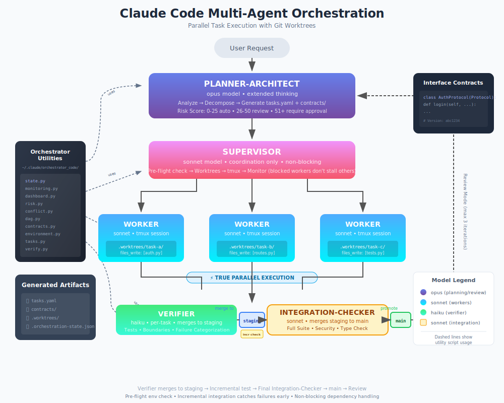

# Claude Code Multi-Agent Orchestration System

A parallel task execution system for Claude Code that uses git worktrees, DAG-based scheduling, and coordinated agents to implement complex multi-file features.

## Overview

This system transforms complex requests into coordinated parallel execution:



## Installation

### 1. Copy agents to your global Claude config

```bash
# Clone this repo (or download the .claude folder)
git clone https://github.com/SynBioExplorer/Claude_Code_agentic_coding.git
cd Claude_Code_agentic_coding

# Copy agents
cp -r .claude/agents/* ~/.claude/agents/

# Copy orchestrator utilities
cp -r .claude/orchestrator_code ~/.claude/

# Copy the orchestrate skill
mkdir -p ~/.claude/skills
cp -r .claude/skills/orchestrate ~/.claude/skills/
```

### 2. Verify installation

```bash
# Test the utilities work
python3 ~/.claude/orchestrator_code/contracts.py TestProtocol method1 method2
python3 ~/.claude/orchestrator_code/environment.py

# Should see no errors
```

### 3. Requirements

- **Claude Code CLI** - The main Claude Code application
- **Git** - For worktree management (must be initialized in project)
- **tmux** - For parallel worker execution
- **Python 3.10+** - For orchestrator utilities
- **rich** - `pip install rich` for live dashboard
- **PyYAML** (optional) - `pip install pyyaml` for YAML parsing

## Usage

### Quick Start - Use the Skill

In any Claude Code session:

```
/orchestrate Add user authentication with JWT tokens and refresh flow
```

This invokes the planner-architect agent which will:
1. Analyze your codebase
2. Create `tasks.yaml` with parallel task definitions
3. Generate interface contracts in `contracts/`
4. Compute risk score and ask for approval if needed
5. Spawn the supervisor to execute

### Manual Invocation

You can also invoke agents directly:

```
Use the planner-architect agent to design an implementation for:
Add a REST API for user management with CRUD operations
```

## Agents

| Agent | Model | Role |
|-------|-------|------|
| `planner-architect` | opus | Analyzes codebase, decomposes into parallel tasks, generates contracts, reviews integration |
| `supervisor` | sonnet | Creates git worktrees, spawns workers in tmux, monitors progress, handles merges |
| `worker` | sonnet | Executes single task in isolated worktree, respects file boundaries |
| `verifier` | opus | Runs tests, validates boundaries, checks contracts and environment hash |

## Orchestrator Utilities

Standalone Python scripts in `~/.claude/orchestrator_code/`:

| Script | Purpose | Example |
|--------|---------|---------|
| `risk.py` | Compute risk score | `python3 ~/.claude/orchestrator_code/risk.py tasks.yaml` |
| `conflict.py` | Detect file/resource conflicts | `python3 ~/.claude/orchestrator_code/conflict.py tasks.yaml` |
| `dag.py` | Validate DAG, show execution waves | `python3 ~/.claude/orchestrator_code/dag.py tasks.yaml` |
| `contracts.py` | Generate Protocol stubs | `python3 ~/.claude/orchestrator_code/contracts.py MyProtocol login logout -o contracts/my.py` |
| `environment.py` | Compute/verify env hash | `python3 ~/.claude/orchestrator_code/environment.py --verify abc123` |
| `state.py` | Manage orchestration state | `python3 ~/.claude/orchestrator_code/state.py init/status/resume` |
| `tasks.py` | Check task readiness | `python3 ~/.claude/orchestrator_code/tasks.py ready tasks.yaml` |
| `verify.py` | Full verification suite | `python3 ~/.claude/orchestrator_code/verify.py full task-a tasks.yaml` |
| `dashboard.py` | Live monitoring dashboard | `python3 ~/.claude/orchestrator_code/dashboard.py` |
| `monitoring.py` | Open/manage monitoring windows | `python3 ~/.claude/orchestrator_code/monitoring.py open` |

All scripts support `--json` for machine-readable output.

### Live Dashboard

Monitor orchestration in real-time:

```bash
# Start live dashboard (updates every second)
python3 ~/.claude/orchestrator_code/dashboard.py

# Custom refresh rate
python3 ~/.claude/orchestrator_code/dashboard.py --refresh 2

# Show once and exit
python3 ~/.claude/orchestrator_code/dashboard.py --once
```

Requires `rich` library: `pip install rich`

### Auto-Opening Monitoring Windows

When `state.py init` runs, monitoring windows open automatically (macOS). Use `--no-monitoring` to disable:

```
┌─────────────────┐  ┌─────────────────┐  ┌─────────────────┐
│  MAIN AGENT     │  │   DASHBOARD     │  │    WORKERS      │
│                 │  │                 │  │ ┌─────┬───────┐ │
│  Supervisor/    │  │ Task   Status   │  │ │wkr-a│ wkr-b │ │
│  Planner runs   │  │ task-a ●running │  │ ├─────┼───────┤ │
│  here           │  │ task-b ○pending │  │ │wkr-c│ wkr-d │ │
│                 │  │                 │  │ └─────┴───────┘ │
│  (your current  │  │ Ctx: 45k/200k   │  │  live output    │
│   terminal)     │  │                 │  │  from workers   │
└─────────────────┘  └─────────────────┘  └─────────────────┘
```

- **Main**: Your Claude Code session (supervisor/planner-architect)
- **Dashboard**: Live status table with context window usage per worker
- **Workers**: Split panes showing real-time output from each worker

## How It Works

### 1. Planning Phase

The planner-architect:
- Analyzes your codebase structure and patterns
- Decomposes the request into independent, parallelizable tasks
- Assigns file ownership (`files_write`) to prevent conflicts
- Generates interface contracts for cross-task dependencies
- Computes risk score for approval gate

### 2. Execution Phase

The supervisor:
- Opens monitoring windows (Dashboard + Workers view)
- Creates isolated git worktrees (`.worktrees/<task-id>/`)
- Spawns worker agents in tmux sessions for true parallelism
- Monitors progress via `.task-status.json` files

### 3. Verification Phase (Per-Task)

Verification happens **per-task, immediately after completion** - not batch at the end:

1. Worker marks task `completed` in `.task-status.json`
2. Supervisor detects completion and spawns Verifier
3. Verifier checks: tests, boundaries, contracts, environment
4. If passed: Supervisor merges task to main
5. Repeat for each completed task

This enables faster feedback and earlier detection of issues.

### 4. Integration Phase

After all tasks verified:
- Supervisor merges task branches to main
- Planner-architect reviews the integrated result
- Accept or iterate (max 3 iterations)

## Task Specification Format

```yaml
request: "Original user request"
created_at: "2025-01-27T10:00:00Z"

tasks:
  - id: task-auth-service
    description: "Implement authentication service"
    files_write:
      - "src/services/auth.py"
      - "tests/test_auth.py"
    files_read:
      - "src/models/user.py"
    resources_write:
      - "di:AuthService"
    depends_on: []
    verification:
      - command: "pytest tests/test_auth.py"
        type: test
        required: true

  - id: task-auth-routes
    description: "Add authentication routes"
    files_write:
      - "src/routes/auth.py"
    depends_on: [task-auth-service]  # Must wait for service
    verification:
      - command: "pytest tests/test_auth_routes.py"
        type: test
        required: true

contracts:
  - name: "AuthServiceProtocol"
    version: "abc1234"
    file_path: "contracts/auth_interface.py"
```

## Key Concepts

### File & Resource Ownership

Each task declares exclusive ownership of files:
- `files_write` - Files this task will create/modify
- `resources_write` - Logical resources (routes, DI bindings)

Conflicts are detected at planning time. Overlapping ownership requires explicit `depends_on`.

### Interface Contracts

For cross-task dependencies:

```python
# contracts/auth_interface.py
"""
Contract: AuthServiceProtocol
Version: abc1234
"""
from typing import Protocol

class AuthServiceProtocol(Protocol):
    def login(self, username: str, password: str) -> dict:
        """Returns {token: str, expires_at: datetime}"""
        ...
```

Workers code against contracts. Max 2 renegotiations allowed.

### Risk Scoring

| Factor | Weight |
|--------|--------|
| Sensitive paths (auth, security, crypto) | +20 |
| Payment/billing paths | +25 |
| Prod/deploy paths | +30 |
| Many tasks (>5) | +5 per extra |
| Many files (>10) | +3 per extra |
| New dependencies | +3 per package |
| Incomplete test coverage | +20 × (1 - coverage) |

**Thresholds:**
- **0-25**: Auto-approve
- **26-50**: Recommend review
- **51+**: Require approval

## Files Created During Orchestration

```
your-project/
├── tasks.yaml                    # Execution plan
├── contracts/                    # Interface Protocol stubs
│   └── auth_interface.py
├── .orchestration-state.json     # Execution state
└── .worktrees/                   # Isolated worktrees (temporary)
    ├── task-auth-service/
    │   └── .task-status.json
    └── task-auth-routes/
        └── .task-status.json
```

## Troubleshooting

### Resume interrupted orchestration

If orchestration was interrupted (user stopped, crash, etc.):

```bash
# See what would be done (dry-run)
python3 ~/.claude/orchestrator_code/state.py resume --dry-run

# Actually resume
python3 ~/.claude/orchestrator_code/state.py resume
```

This will:
- Reset tasks stuck in "executing" to "pending"
- Clean up incomplete worktrees and orphaned tmux sessions
- Reopen monitoring windows
- Report tasks ready for verification or merge

Then continue from supervisor Stage 2 (spawn workers for pending tasks).

### Check orchestration status
```bash
python3 ~/.claude/orchestrator_code/state.py status
```

### View monitoring windows
```bash
# Dashboard window
tmux attach -t "orchestrator-dashboard"

# Workers window
tmux attach -t "orchestrator-workers"

# Detach with Ctrl-b d
```

### List tmux worker sessions
```bash
tmux list-sessions | grep "worker-"
```

### View worker output
```bash
tmux attach -t "worker-<task-id>"
# Detach with Ctrl-b d
```

### Kill stuck worker
```bash
tmux kill-session -t "worker-<task-id>"
```

### Clean up worktrees
```bash
git worktree list
git worktree remove .worktrees/<task-id>
```

### Kill all orchestration sessions
```bash
# Kill monitoring windows
tmux kill-session -t "orchestrator-dashboard" 2>/dev/null
tmux kill-session -t "orchestrator-workers" 2>/dev/null

# Kill all worker sessions
tmux list-sessions -F '#{session_name}' | grep '^worker-' | xargs -I {} tmux kill-session -t {}
```

## License

MIT

## See Also

- [ARCHITECTURE_8.md](ARCHITECTURE_8.md) - Full architecture specification
- [.claude/agents/](.claude/agents/) - Agent definitions
- [.claude/orchestrator_code/](.claude/orchestrator_code/) - Utility scripts
